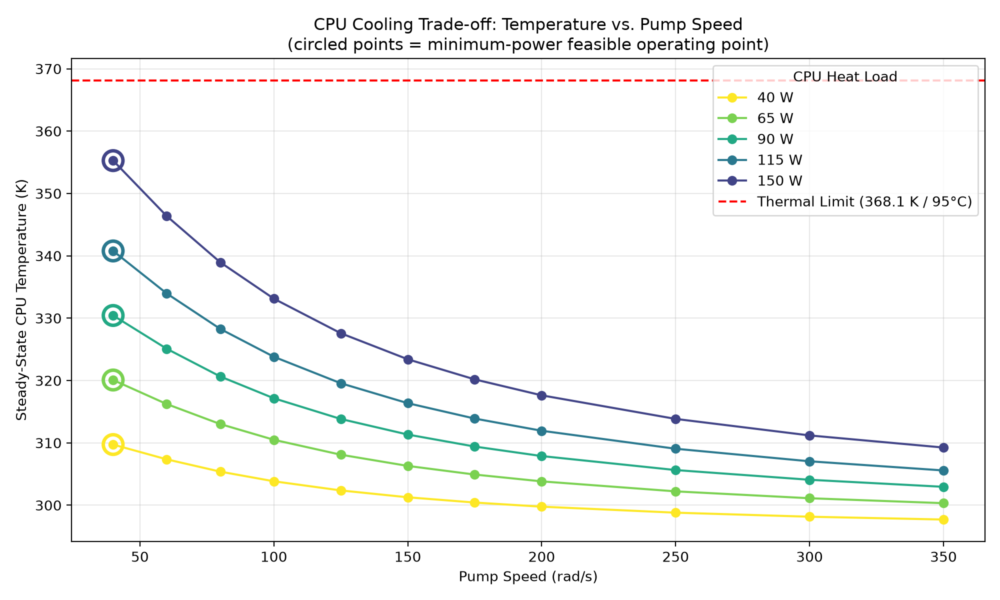

# 🖥️ Cooling a Server CPU — Finding the Sweet Spot Between Power and Temperature

*A physics-based simulation, automated with Python, that answers a simple question: how hard does a cooling pump actually need to work?*

<p align="center">
  
</p>

---

## What this project does

Every server CPU generates heat that has to be carried away by a coolant loop — a pump pushes liquid past the chip, and that liquid carries the heat off to be dumped elsewhere.

Run the pump faster, and the chip stays cooler — but the pump itself burns more electricity, and that cost grows very fast, not gradually. Run the pump slower, and you save power — but risk the chip overheating.

**This project builds a simulated version of that cooling loop, and automatically finds the slowest — and therefore cheapest — pump speed that still keeps the chip safely cool, across a wide range of realistic chip power levels — from a light 40W load up to a demanding 500W load.**

> **Note on scope:** this models the cooling loop for a *single CPU* (one "socket," in data center terms) — the kind of per-chip cold plate found inside a server. A full server rack contains many CPUs plus other components, so a whole rack's total heat output is much larger than the range studied here. This project optimizes one cooling unit — the building block of a much bigger system.

---

## The Science, in Plain Terms

### 1. Heat has to go somewhere

A CPU under load doesn't just get hot and stay hot forever — it heats up quickly at first, then levels off once it's losing heat to the coolant just as fast as it's generating it. This "leveling off" point is called **steady state**, and it's governed by a simple balance:

> **Heat coming in = Heat leaving**

If a chip generates 65 Watts of heat, the cooling system has to carry away exactly 65 Watts once things settle — no more, no less. This is just conservation of energy, the same principle behind why a cup of coffee eventually cools to room temperature and stops.

### 2. How fast heat leaves depends on how effectively the coolant "grabs" it

Heat moves from the hot chip into the moving coolant through a process called **convection** — think of it like a river washing heat away from a warm rock. As the pump spins faster, the coolant moves faster and becomes more effective at pulling heat away — but with **diminishing returns**. Doubling the flow rate doesn't double the cooling effectiveness; each extra bit of speed buys progressively less benefit. This is exactly why every curve in the plot above flattens out as pump speed increases.

### 3. Pumping fluid isn't free — and it gets expensive fast

Pushing liquid through a loop takes energy, and for the type of pump used here (a centrifugal pump — the same basic design used in everything from car engines to home water pumps), the power required grows roughly with the **cube** of its speed. Practically: double the pump speed, and the power cost can rise closer to **8×**, not 2×. This is a well-known real-world relationship (a pump "affinity law"), and it's exactly why blindly running a pump at max speed "to be safe" is wasteful — you pay a steep, escalating price for cooling gains that themselves are shrinking.

### 4. Putting it together — the actual optimization

For each chip power level, the simulation runs across a range of pump speeds, tracking both the chip's final temperature and the pump's power draw at each one. The answer, for each power level, is simple: **the slowest pump speed that still keeps the chip under a safe temperature limit.** Any slower risks overheating; any faster just burns extra power for no real benefit.

---

## How It Was Built

| Stage | Tool | What Happens |
|---|---|---|
| Physical model | MATLAB Simscape | A real, physics-based simulation of coolant flow, pump behavior, and heat transfer — not a simplified spreadsheet formula |
| Validation | Hand calculations | Every part of the model (heating curve, steady-state temperature, pump flow rate) was checked by hand against the simulation before trusting it |
| Automation | Python (`matlab.engine`) | Python programmatically runs the simulation dozens of times, sweeping across pump speeds and chip power levels, with zero manual clicking |
| Optimization | Python | For each chip power level, the script scans the results and picks the lowest-power pump speed that keeps the chip safe |

---

## Results

The full sweep covers 12 chip power levels (40–500W) and pump speeds from 40 to 200 rad/s. The optimizer found three distinct regimes:

| Heat Load (W) | Optimal Speed (rad/s) | CPU Temp (K) | Pump Power (W) |
|---|---|---|---|
| 40  | 40  | 309.7 | 1.62 |
| 65  | 40  | 320.1 | 1.62 |
| 90  | 40  | 330.4 | 1.62 |
| 115 | 40  | 340.8 | 1.62 |
| 150 | 40  | 355.3 | 1.62 |
| 200 | 60  | 364.1 | 9.09 |
| 250 | 100 | 359.8 | 45.77 |
| 300 | 125 | 362.0 | 89.84 |
| 350 | 150 | 363.7 | 155.42 |
| 400 | 175 | 365.1 | 246.83 |
| 450 | 200 | 366.3 | 368.39 |
| 500 | — | — | **no speed in the tested range (up to 200 rad/s) kept it under the thermal limit** |

**Three regimes, one plot:**

1. **40–150W — power-limited.** The pump's own lowest usable speed already cools these loads with margin to spare. There's nothing to optimize here except "don't run the pump any faster than it needs to be."
2. **200–450W — thermally-limited.** This is the real trade-off zone. Required pump speed climbs steadily, and pump power explodes — from 1.62W to 368.39W, a **227× increase**, to hold the chip just under its safety limit.
3. **500W — infeasible within the tested range.** No pump speed up to 200 rad/s kept the chip safe. This either marks a genuine limit of this cooling design, or simply means a higher speed than tested would be needed — worth testing further before treating it as a hard ceiling.

---

## Try It Yourself

```bash
python scripts/sweep_pump_speed.py       # runs the full simulation sweep
python scripts/optimize.py               # finds the optimal pump speed per chip power level
python scripts/compute_optimal_power.py  # records the pump power cost at each optimal point
python scripts/plot_final_tradeoff.py    # generates the plot above
```

Requires MATLAB with Simscape, and Python 3.11 with the MATLAB Engine API installed.

---

## Engineering Notes Worth Knowing

- The convective heat transfer coefficient (`h`) is modeled as flow-dependent, `h = C·ṁ^0.8` — a fixed value made pump speed almost irrelevant to cooling and was corrected after being caught during validation.
- The centrifugal pump has a genuine minimum operating speed (below ~33 rad/s it produces no real pressure rise); this floor was identified and excluded from the valid sweep range.
- Every governing relationship (energy balance, transient thermal response, pump flow law) was validated against hand calculations before any automation was trusted.

---

*B.E. Mechanical Engineering · M.Sc. Process, Energy & Environmental Systems Engineering, TU Berlin*
